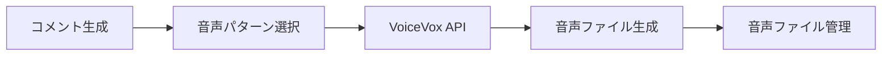

# 音声自動化システム設計書

## システム概要

VoiceVoxを活用した音声自動生成システム。生成されたコメントを複数の音声パターンで自動的に音声化する。

## アーキテクチャ



## 利用可能な音声キャラクター・スタイル

### 四国めたん
- あまあま (ID: 0)
- ノーマル (ID: 2)
- ツンツン (ID: 6)
- セクシー (ID: 4)
- ささやき (ID: 36)
- ヒソヒソ (ID: 37)

### ずんだもん
- あまあま (ID: 1)
- ノーマル (ID: 3)
- ツンツン (ID: 7)
- セクシー (ID: 5)
- ささやき (ID: 22)
- ヒソヒソ (ID: 38)
- ヘロヘロ (ID: 75)
- なみだめ (ID: 76)

## システム構成

### 1. 音声パターン管理
```typescript
interface VoicePattern {
  id: string;
  character: string;
  style: string;
  speakerId: number;
  description: string;
  enabled: boolean;
}
```

### 2. VoiceVox API クライアント
- エンドポイント: `http://localhost:50021`
- 主要API:
  - `/speakers` - 話者一覧取得
  - `/audio_query` - 音声クエリ生成
  - `/synthesis` - 音声合成実行

### 3. 音声生成パイプライン
1. **テキスト前処理**: コメントの整形・最適化
2. **パターン選択**: 複数パターンからランダム/条件選択
3. **音声合成**: VoiceVox APIによる音声生成
4. **ファイル管理**: 音声ファイルの保存・管理

## ディレクトリ構造

```
src/
├── voice/
│   ├── patterns/           # 音声パターン定義
│   ├── client/            # VoiceVox APIクライアント
│   ├── generator/         # 音声生成ロジック
│   └── manager/           # 音声ファイル管理
├── config/
│   └── voice-patterns.json # 音声パターン設定
└── audio/                 # 生成音声ファイル保存
    ├── zundamon/
    ├── metan/
    └── temp/
```

## 音声パターン選択ロジック

### 1. ランダム選択
利用可能なパターンからランダムに選択

### 2. 条件付き選択
- 時間帯による選択（朝：あまあま、夜：ささやき）
- コメント内容による選択（感情分析ベース）
- ユーザー設定による選択

### 3. ローテーション
設定されたパターンを順番に使用

## API仕様

### VoiceVox連携
```typescript
class VoiceVoxClient {
  async getSpeakers(): Promise<Speaker[]>
  async generateAudioQuery(text: string, speakerId: number): Promise<AudioQuery>
  async synthesize(audioQuery: AudioQuery, speakerId: number): Promise<ArrayBuffer>
}
```

### 音声生成
```typescript
class VoiceGenerator {
  async generateSpeech(text: string, pattern: VoicePattern): Promise<string>
  async generateMultiplePatterns(text: string, patterns: VoicePattern[]): Promise<string[]>
}
```

## 設定管理

### voice-patterns.json
```json
{
  "patterns": [
    {
      "id": "zundamon-normal",
      "character": "ずんだもん",
      "style": "ノーマル",
      "speakerId": 3,
      "description": "標準的なずんだもんの声",
      "enabled": true
    },
    {
      "id": "metan-amaam",
      "character": "四国めたん",
      "style": "あまあま",
      "speakerId": 0,
      "description": "甘い四国めたんの声",
      "enabled": true
    }
  ],
  "selectionMode": "random", // random, rotation, conditional
  "conditionalRules": {
    "morning": ["metan-amaam"],
    "evening": ["zundamon-sasayaki"],
    "excited": ["zundamon-tsuntsun"],
    "sad": ["zundamon-namidame"]
  }
}
```

## エラーハンドリング

### VoiceVox接続エラー
- フォールバック: テキストファイル出力
- リトライ機構: 3回まで自動リトライ
- ログ記録: エラー詳細の記録

### 音声生成エラー
- パターン切り替え: エラー時の代替パターン使用
- 部分生成: 長文の場合の分割処理

## パフォーマンス最適化

### 1. キャッシュ機構
- AudioQuery結果のキャッシュ
- 頻繁に使用されるフレーズの音声キャッシュ

### 2. 非同期処理
- 複数パターンの並列生成
- バックグラウンド生成

### 3. ファイル圧縮
- 音声ファイルの最適化
- 古いファイルの自動削除

## 今後の拡張予定

### 1. 感情分析連携
コメント内容から感情を分析し、適切な音声パターンを自動選択

### 2. 音声効果
- 速度調整
- ピッチ調整
- エコー・リバーブ効果

### 3. 複数音声の同時再生
- 対話形式の音声生成
- ハーモニー効果

### 4. カスタム音声パターン
- ユーザー定義の音声設定
- 独自キャラクターの追加